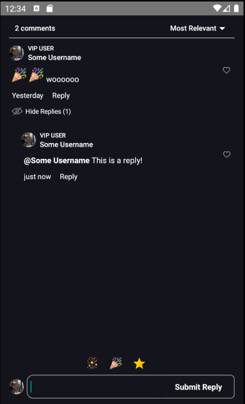
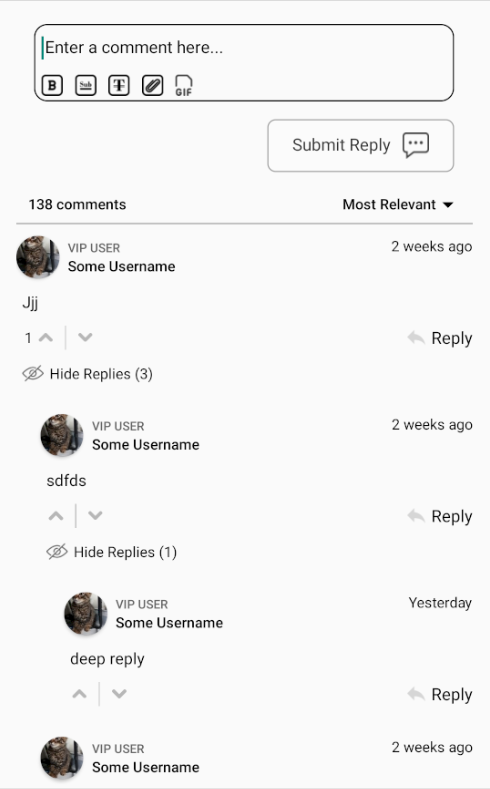
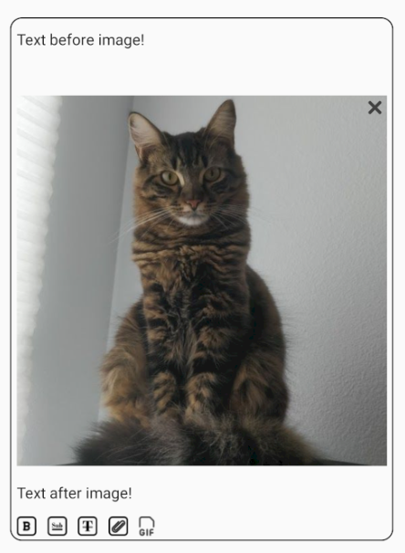

# fastcomments-react-native-sdk

[](https://www.npmjs.com/package/fastcomments-react-native-sdk)

## Installation

[](https://www.npmjs.com/package/fastcomments-react-native-sdk)

```sh
npm install fastcomments-react-native-sdk --save
```

## About

This library is a complete react-native implementation of [FastComments](https://fastcomments.com).

It supports live commenting, chat, threads, emoticons, notifications, SSO, skins, and full customization by passing in a stylesheet object. All assets
can also be customized, and it supports toggling different assets based on dark mode.

The benefit of this library is that it is more flexible than the `fastcomments-react-native` wrapper. Comments are rendered with native components rather than inside a webview.

It all runs on the FastComments backend, so you only have to incorporate the UI:

```tsx
    <FastCommentsLiveCommenting config={config} styles={styles} callbacks={callbacks} assets={assets}/>
```

See [example/src](./example/src) for more examples.

Add live chat to your existing React Native application, or even build a social network!

## Screenshots

#### Skin: Erebus

#### Skin: Default

#### Native WYSIWYG Editor with Image Support!


### Rich Text Editor

This library uses [`react-native-enriched`](https://github.com/software-mansion/react-native-enriched) for rich text editing, which provides a powerful WYSIWYG editing experience. The same editor powers iOS, Android, and the web (via `react-native-web`), so the composer behaves consistently across every platform with a single implementation.

`react-native-enriched` requires the React Native New Architecture (Fabric) on native, and a bundler that resolves package `exports` conditions (Metro with package exports / RN 0.72+). Web support is currently experimental.

### Widgets

The SDK ships three widgets, mirroring the FastComments Android SDK:

- `FastCommentsLiveCommenting` - threaded commenting with votes, replies, pagination, mentions, notifications, and live updates.
- `FastCommentsLiveChat` - a chat preset over the same engine: chronological messages with new ones at the bottom, the composer below the list, a live header strip (connection dot + user count), infinite history loaded by scrolling up, auto-scroll to new messages, no votes or reply threading. Every preset can be overridden via `config`.
- `FastCommentsFeed` - a social feed with post composer, media, reactions, follows, and live new-post banners.

```tsx
    <FastCommentsLiveChat config={{ tenantId: 'demo', urlId: 'my-room' }}/>
```

### Theming

The default look is generated from a set of semantic design tokens (`FastCommentsTheme`): colors, spacing, radii, font sizes, font weights, and avatar sizes. Pass partial token overrides through the `theme` prop on any widget and the entire style tree restyles consistently:

```tsx
    <FastCommentsLiveCommenting config={config} theme={{ colors: { primary: '#FF5500' } }}/>
```

Dark mode is one token set away:

```tsx
    import { getDarkTheme } from 'fastcomments-react-native-sdk';

    <FastCommentsLiveCommenting config={config} theme={getDarkTheme()}/>
```

The `styles` prop still accepts a raw `IFastCommentsStyles` tree for surgical control. When `theme` and `styles` are both provided, the explicit styles win over the themed tree; when only `styles` is provided, it replaces the defaults entirely (the original behavior, so existing integrations and skins are unaffected). `setupDarkModeSkin` is deprecated in favor of the `theme` prop.

### Configuration Options

This library aims to support all configuration options defined in [fastcomments-typescript](https://github.com/FastComments/fastcomments-typescript/blob/main/src/fast-comments-comment-widget-config.ts), just like the web implementation.

### FastComments Concepts

The main concepts to be aware of to get started are `tenantId` and `urlId`. `tenantId` is your FastComments.com account identifier. `urlId` is where comment threads
will be tied to. This could be a page URL, or a product id, an article id, etc.

### User Notifications

FastComments supports notifications for [many scenarios](https://docs.fastcomments.com/guide-notifications.html). Notifications are configurable,
can be opted-out globally or at a notification/comment level, and supports page-level subscriptions so that users can subscribe to threads of a
specific page or article.

For example, it is possible to use Secure SSO to authenticate the user and then periodically poll for unread notifications and push them to the user.

See [the example AppNotificationSecureSSO](./example/src/AppNotificationsSecureSSO.tsx) for how to get and translate unread user notifications.

### Gif Browser

By default, no image or gif selection is enabled. See [example/src/AppCommentingImageSelection.tsx](./example/src/AppCommentingImageSelection.tsx) for how
to support image and gif uploads. There is a Gif Browser that anonymizes searches and images provided in this library, you simply have to use it.

### Performance

Please open a ticket with an example to reproduce, including device used, if you identify any performance problems. Performance is a first-class citizen
of all FastComments libraries.
